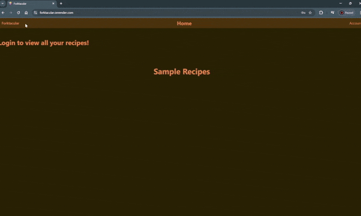
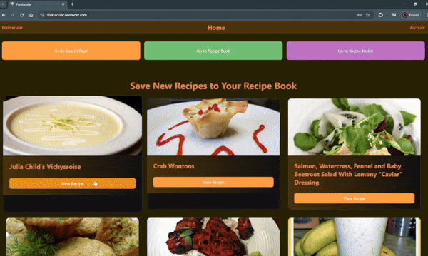
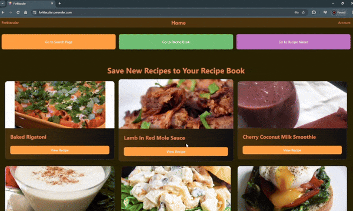
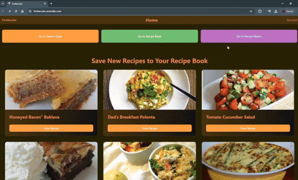

# Forktacular
 
## Description

 This is a recipe app that lets users save and create recipes online. This is so that users can take a more modern approach to the recipe books you would have at home while being able to take up less space.

## 📁 Table of Contents
- [Installation](#installation)
- [Usage](#usage)
- [Contributing](#contributing)

## Usage

1. View Recipies


<br/>
<br/>
<br/>
<br/>
<br/>
<br/>

2. Change Account Information


<br/>
<br/>
<br/>
<br/>
<br/>
<br/>

3. Save Recipes


<br/>
<br/>
<br/>
<br/>
<br/>
<br/>

4. Search for Recipes


<br/>
<br/>
<br/>
<br/>
<br/>
<br/>

5. Create Custom Recipies


## Installation

please visit [our deployed site](https://forktacular.onrender.com/) to access the application. If you want to run the application from your local machine, follow these instructions:

Ensure you have the Node Package Manager and Postgres installed on your machine. You will need a JWT Secret Key, a Spoonacular API key, and optionally an OpenAI API key.
- [Node.js](https://nodejs.org)
- [Postgres installation guide](https://coding-boot-camp.github.io/full-stack/postgresql/postgresql-installation-guide)
- [Generate a JWT Secret Key](https://pinetools.com/random-string-generator)
- [Spoonacular API Key](https://spoonacular.com/food-api/console#Dashboard)
- [OpenAI API Key](https://platform.openai.com/settings/organization/api-keys)
```shell
# Step 1: clone this repository, and go to the root directory
git clone https://github.com/Dan-Swarts/Forktacular.git
cd Forktacular

# Step 2: Ensure you have node installed, then use the Node Package Manager to install dependencies:
node -v 
# Example output: v20.17.0
npm install

# Step 3: The application relys on a sequalize database connection. We recomend using a postgres
# connection by following the postgres installation guide above. Then run the schema.sql file found
# in the db folder:
psql -U postgres 
# here, you will be prompted to enter your password:
postgres=* \i server/db/schema.sql
postgres=* \q

# Step 4: remove the '.example' from .env.example. Fill in the .env file with your Postgres password,
# JWT Secret Key, Spoonacular API Key, and optionally fill in the port number and/or the OpenAI API
# Key.

# Step 5 (optional): seed the database:
cd server/
npm run build
npm run seed
cd ../ 

# Step 6: start the application:
npm run build

# step 7: acess the application through your web browser
# http://localhost:3001/
```

## Contributing

> [!IMPORTANT]
> Whether you have feedback on features, have encountered any bugs, or have suggestions for enhancements, we're eager to hear from you. Your insights help us make the react-portfolio library more robust and user-friendly.

Please feel free to contribute by [submitting an issue](https://github.com) or [joining the discussions](https://github.com). Each contribution helps us grow and improve.

We appreciate your support and look forward to making our product even better with your help!
